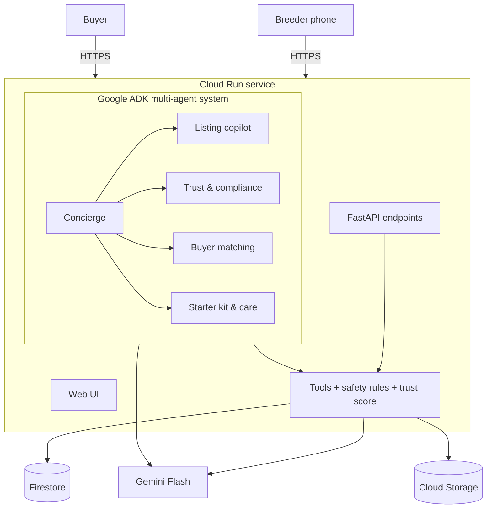

# PetZonic AI 🐾

### Find the trusted breeder next door: AI agents for safe, fair, direct pet commerce

**Google Cloud AI Builder Cup 2026 (JAPAC) · Theme: Retail & Commerce**

> 🚧 **Status: in active development** during the AI Builder Cup build window (prototype submission: 18 Oct 2026).
> The live demo link and demo video will be added here at submission. This README describes only what is built or being built. Future ideas are listed under [Roadmap](#roadmap).

---

## The problem

> **"The breeder is 50 metres away. The customer never finds them."**

Our founder spent five years as a bird breeder and broker in Coimbatore, India. Over and over he saw the same thing:

- **New buyers walk into a pet shop and overpay**, often for a less healthy animal, because the breeder down the street is invisible online.
- **The real market is hidden** in district WhatsApp and Facebook groups, visible only to insiders.
- **Buyers can't tell good sellers from bad.** Scams are common, and protected native birds are still traded illegally, sometimes dyed to disguise them.
- **Breeders lose hours every day** to manual selling: repeating answers, confirming stock, negotiating.

## What PetZonic AI does

| Step | What happens | How |
|---|---|---|
| **List** | A breeder sends photos plus a casual message, the way they'd post on WhatsApp, in English or Tamil. They get a complete, priced listing ready to publish. | Gemini multimodal and multilingual extraction into a validated schema; fair-price range from data |
| **Check** | Every listing is screened before buyers see it. Protected species are **blocked**. Dyed birds, visible health concerns, reused photos, suspicious prices and scam language are flagged. Buyers see an explainable trust score. | Gemini vision + deterministic rules (perceptual hashing, price rules, species lists) → trust score **computed in code** |
| **Find** | A buyer describes their home, family and budget. PetZonic suggests suitable pets and finds trusted breeders nearby, with fair-price indicators. | ADK agent with tool calls over Firestore; distance by district |
| **Start right** | A personalised starter kit (correct cage size, food, accessories) and a first-14-days care plan with "see a vet if…" signs | Product rules + Gemini structured care plans |
| **Is this listing safe?** | Upload a screenshot of a post seen on WhatsApp or Instagram and get the same trust screening | Same pipeline, nothing stored |

## Architecture

| Layer | Technology |
|---|---|
| AI model | Gemini Flash (newest generally available version, set via configuration) |
| Agent framework | Google Agent Development Kit (ADK), Python |
| Runtime | Google Cloud Run |
| Database | Firestore |
| File storage | Cloud Storage (private bucket) |
| Build / deploy | Cloud Build, Artifact Registry |
| Quality | pytest unit tests, ADK evaluations, GitHub Actions |

Full design: [docs/implementation/01-architecture.md](docs/implementation/01-architecture.md)

## Safety and compliance by design

**AI perceives and converses; code decides.**

- Listings of protected Indian native species are **blocked in code**, whatever the model says.
- Trust scores come from a transparent, deterministic formula. Every badge shows its reasons.
- Dog listings need a State Animal Welfare Board registration number (checked against a *simulated* registry in this prototype).
- Health observations are "signs to ask the seller about", never a diagnosis. No medicine or dosage advice.
- Starter kits respect minimum cage sizes per species.

Details: [docs/product/03-responsible-ai-and-safety.md](docs/product/03-responsible-ai-and-safety.md)

## Simulated vs real

This is a hackathon prototype. To be transparent:

| Component | In this prototype |
|---|---|
| Breeders, listings, accessories | **Synthetic**: fictional names and brands; generated or our own images |
| Fair-price ranges | **Sample data** based on the founder's experience |
| State Animal Welfare Board registry | **Simulated**, with clearly fake `SIM-` numbers |
| Protected / CITES species lists | Curated from public sources (cited in the data files). Not legal advice. |
| Enquiries and cart | **Demo only**: no breeder is contacted, no payment is taken |
| AI extraction, screening, matching, care plans | **Real**: live Gemini calls |
| Trust score, species blocking, welfare rules | **Real**: enforced in code and covered by tests |

PetZonic AI is not a veterinary service and does not sell animals or products.

## Getting started

Setup and deployment are documented step by step in [docs/implementation/05-gcp-setup-and-deployment.md](docs/implementation/05-gcp-setup-and-deployment.md). Local run commands will be added here as the code lands.

## Documentation

All planning, design and submission docs are in [docs/](docs/README.md).

## Roadmap

These are future ideas and are **not** part of the current prototype:

- List a pet by sending a WhatsApp message (WhatsApp Business Platform)
- Integration with State Animal Welfare Board and PARIVESH records
- Breeder score from buyer feedback and animal health after sale
- Escrow-protected payments and health guarantees
- Lifelong pet ID (leg ring / microchip), vet consultations, pharmacy
- Tamil, Hindi and other regional-language interfaces

## How it was built

All code in this repository was written during the AI Builder Cup 2026 build window, by the team with the help of AI coding assistants. Every change is reviewed by the team. The running application uses only Google AI models (Gemini).

## Team

- Sudarsan N (team lead; 5 years as a bird breeder and broker)
- Shreya Azad

## License

MIT. See [LICENSE](LICENSE). Third-party assets are listed in [ATTRIBUTIONS.md](ATTRIBUTIONS.md).
