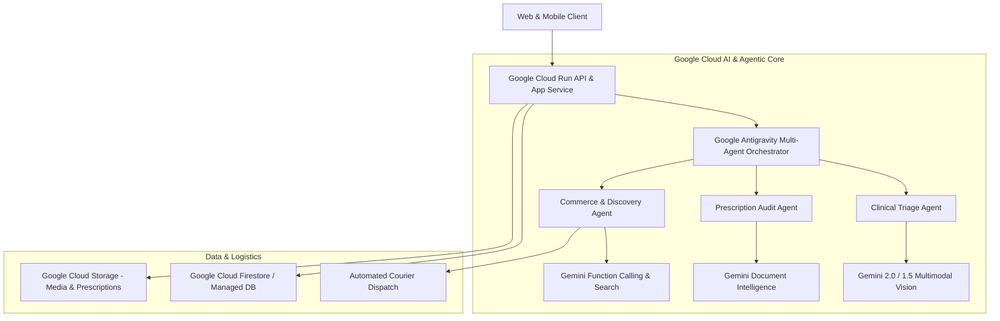

# PetZonic AI 🐾
### Autonomous Agentic Pet Healthcare & Multimodal Commerce Platform
**Built for the Google Cloud AI Builder Cup 2026 (JAPAC Edition)**

[](https://cloud.google.com/run)
[](https://ai.google.dev/)
[](https://cloud.google.com/)
[](https://opensource.org/licenses/MIT)

---

## 📌 Executive Summary
**PetZonic AI** is an autonomous, agentic pet care and ethical commerce engine designed to solve the fragmented, opaque, and unregulated pet lifecycle. By integrating **Gemini Multimodal Vision**, **Google Antigravity Agentic Orchestration**, and **Google Cloud Run**, PetZonic AI provides:
1. **Instant Veterinary Clinical Triage**: Vision-based symptom analysis (dermatology, ocular, oral) from smartphone photos with emergency scoring.
2. **Prescription Verification & Safety Audit**: Autonomous OCR extraction of veterinary prescriptions, cross-referencing against Schedule H/VCI regulatory registries and flagging contraindications.
3. **Conversational Multi-Turn Shopping Concierge**: Natural language intent extraction, semantic product recommendations, and automated tool/function calling.
4. **Verified Ethical Breeder & Farm Hub**: Real-time geolocation, certification auditing, and direct farm discovery eliminating predatory puppy mills.

---

## 🏗️ Architecture & Google Cloud Tech Stack



---

## 🚀 Key Innovation Highlights

- **Multimodal Veterinary Intelligence**: Upload an image of a pet's skin rash, lesion, or physical symptom to receive immediate severity triage, care instructions, and recommended specialists.
- **Autonomous Tool-Calling Agents**: Agents independently query real-time pharmacy inventory, check cold-chain medication availability, and book verified telehealth consultations.
- **Strict Compliance Gating**: Prevents automated dispatch of regulated Schedule H veterinary drugs without an AI-verified prescription.
- **Cloud-Native Scalability**: 100% serverless microservices containerized for zero-cold-start performance on Google Cloud Run.

---

## 🛠️ Getting Started

### Prerequisites
- Node.js 20+ / Docker
- Google Cloud SDK (`gcloud`)
- Gemini API Key / Google AI Studio Key

### Local Development
```bash
# Clone the repository
git clone https://github.com/sudarsan-22/petzonic-ai.git
cd petzonic-ai

# Install dependencies
npm install

# Set environment variables
cp .env.example .env

# Run local development server
npm run dev
```

---

## 📄 License
This project is licensed under the MIT License — see the LICENSE file for details.
