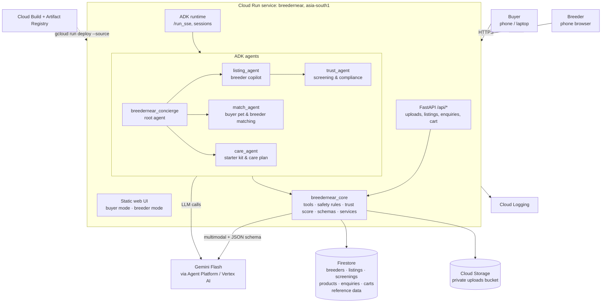
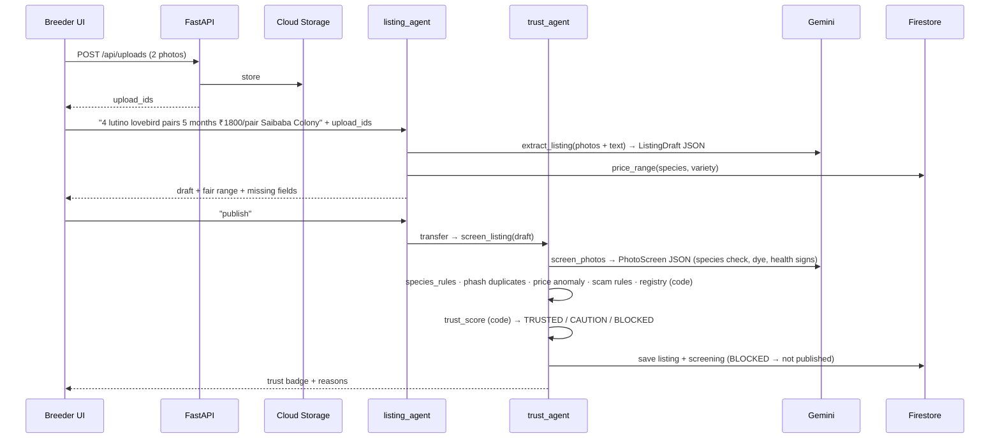

# Architecture

## Design principles

1. **One deployable service.** A single Cloud Run service serves the web UI, our API and the ADK agent runtime. Fewer moving parts means fewer things break during judging. (The session advised: *"progressive architecture… use the simplest components"*.)
2. **AI perceives and converses; code decides.** Gemini reads photos and messy text, extracts structure, matches needs and talks. Legal, trust and welfare decisions (blocked species, trust score, price ranges, cage sizes) are plain Python with unit tests.
3. **Structured outputs where it matters.** Listing extraction, photo screening and care plans return Pydantic-validated JSON.
4. **Business state lives in Firestore**, not chat memory: listings, screenings, enquiries and carts survive restarts.
5. **Configuration over code.** Model ID, region, limits and thresholds come from env vars or seed data.

## System diagram



## Flow 1: breeder lists in under a minute



## Flow 2: buyer finds a pet and gets started

```mermaid
sequenceDiagram
    participant UI as Buyer UI
    participant C as concierge
    participant M as match_agent
    participant K as care_agent
    participant FS as Firestore

    UI->>C: "Pet bird for my 8-year-old, flat in Tiruppur, ₹3000"
    C->>M: transfer
    M->>M: recommend_species(needs) (rules + Gemini reasoning)
    M->>FS: search_listings(species, district, max_price) (excludes BLOCKED; sorted trust→distance→price)
    M-->>UI: 3 listing cards with trust badges and fair-price markers
    UI->>M: "I'll take the budgie pair from Karthik"
    M->>K: transfer
    K->>FS: build_starter_kit(species, count) (welfare rules filter)
    K-->>UI: kit cards + total + 14-day care plan + vet warning signs
    UI->>FS: create_enquiry (demo)
```

## Google Cloud services

| Service | Use | Why this one |
|---|---|---|
| **Cloud Run** | Hosts the whole app (UI + API + agents) | Mandatory option; serverless autoscaling; one-command deploy from source |
| **Gemini (Flash)** via Agent Platform / Vertex AI | Multimodal extraction and screening, conversation, matching, care plans | Mandatory; multimodal; multilingual (Tamil/English); structured output |
| **ADK** (Agent Development Kit, Python) | Multi-agent orchestration, tool calling, sessions, callbacks, evals | Google's recommended agent framework (session) |
| **Firestore** (Native mode) | Breeders, listings, screenings, products, enquiries, carts, reference data | Recommended as easiest DB (session); serverless; vector search for stretch F9 |
| **Cloud Storage** | Uploaded listing photos (private bucket, 30-day lifecycle) | Object storage |
| **Cloud Build + Artifact Registry** | Build the container during `gcloud run deploy --source` | Comes with source deploys |
| **Cloud Logging** | Request logs, agent/tool traces, errors | Debugging during evaluation |
| Secret Manager | Only if an API key is ever needed | No secrets in the repo |

Not used, to keep it simple: load balancer, CDN, Cloud SQL, BigQuery, Pub/Sub, Maps (stretch F11). These are named in the deck as the **scale-up path**.

## Key decisions

| Decision | Choice | Alternatives considered |
|---|---|---|
| Language | Python 3.12 | TypeScript ADK: less mature |
| Agent framework | ADK | Raw Gemini SDK: less structure, no built-in evals or sessions |
| Model | Newest GA Gemini Flash (`gemini-3.8-flash` as of 9 Oct 2026), via `BREEDERNEAR_MODEL` | Pro: slower and costlier. `gemini-2.x`: retiring 20 Oct. |
| Trust decision | Deterministic scoring in code from individual checks | Letting the LLM decide: not auditable, can be talked out of it |
| Duplicate photos | Perceptual hashing (`imagehash` + Pillow) | Asking the LLM: unreliable and costly |
| Distance | District centroids (lat/lng) + haversine in code | Maps API: stretch only |
| Frontend | Vanilla HTML/CSS/JS served by FastAPI, no build step | React/Next: more tooling and risk. ADK dev UI: a developer tool, not end-user UX. |
| ADK sessions | **MVP:** in-memory, `--max-instances=1`, session affinity. **Upgrade if time:** persistent session service (`agentengine://` or Cloud SQL), then raise `max-instances` | Chat history loss is acceptable; business data is in Firestore |
| Images to tools | Upload to GCS → pass `upload_id` in the message → tool loads the image and calls Gemini with a schema | Inline images in chat context: tokens every turn, unconstrained output |
| Auth | Guest ID (UUID in `localStorage`); demo breeder/buyer identities | Real login: a barrier for judges |
| Region | Cloud Run `asia-south1`; Gemini `global` endpoint | — |
| Runtime AI | **Google models only** (Gemini via Agent Platform). No other providers' model APIs. | — |
| Dependencies | Permissive licences only (MIT, BSD, Apache-2.0, HPND), installed from PyPI, never vendored | Copyleft (GPL/AGPL): conflicts with our MIT licence and IP warranty |

## Repository layout (target)

```
breedernear-ai/
├── agents/
│   └── breedernear/                 # ADK app (name: "breedernear")
│       ├── __init__.py           # from . import agent
│       ├── agent.py              # root_agent + sub-agents wiring
│       └── prompts.py
├── breedernear_core/                # business logic, unit-testable without ADK
│   ├── config.py
│   ├── schemas.py                # ListingDraft, PhotoScreen, Screening, CarePlan…
│   ├── safety/
│   │   ├── species_rules.py      # protected / CITES lists, synonyms (incl. Tamil)
│   │   ├── scam_rules.py
│   │   ├── price_rules.py
│   │   ├── welfare_rules.py      # minimum cage sizes etc.
│   │   └── trust_score.py        # deterministic scoring
│   ├── services/
│   │   ├── firestore.py
│   │   ├── storage.py
│   │   ├── gemini.py             # structured multimodal calls
│   │   ├── images.py             # perceptual hashing
│   │   └── geo.py                # district centroids, haversine
│   └── tools/
│       ├── listing.py            # extract_listing, publish_listing
│       ├── trust.py              # screen_listing
│       ├── match.py              # recommend_species, search_listings
│       ├── care.py               # build_starter_kit, care_plan
│       └── commerce.py           # cart, enquiries
├── app/
│   ├── main.py                   # get_fast_api_app(...) + /api routes + static files
│   ├── api.py
│   └── ratelimit.py
├── web/                          # index.html, app.js, styles.css, img/
├── data/
│   ├── seed/                     # breeders, listings, products, price_ranges, districts,
│   │                             # protected_species, cites_species, sawb_registry_sample
│   └── samples/                  # demo photos for evals and the video
├── scripts/                      # seed_firestore.py, smoke_test.py, deploy.sh
├── tests/                        # pytest unit + integration
├── evals/                        # ADK *.evalset.json + test_config.json
├── .github/workflows/ci.yml
├── Dockerfile, requirements.txt, .env.example, .gitignore
├── ATTRIBUTIONS.md, LICENSE, README.md
└── docs/
```

## Scale-up path (for the deck's "production" slide)

| Concern | Prototype | Production |
|---|---|---|
| Traffic | 1 Cloud Run instance | Autoscale N instances; persistent sessions; load balancer + Cloud CDN |
| Breeder onboarding | Web form + chat | WhatsApp Business Platform: list by sending a message |
| Registry checks | Simulated SAWB registry, static species lists | Integration with SAWB and PARIVESH records where available; human review queue |
| Trust | Rule-based score from listing signals | Plus buyer feedback, post-sale health outcomes, verified premises visits |
| Search | Attribute filter + distance | Vector Search on Agent Platform; Maps-based radius search |
| Insights | Sample price ranges | BigQuery over real listings: district demand, fair-price index, seasonal trends |
| Payments | None (demo enquiry) | Escrow-protected payments after compliance review |
